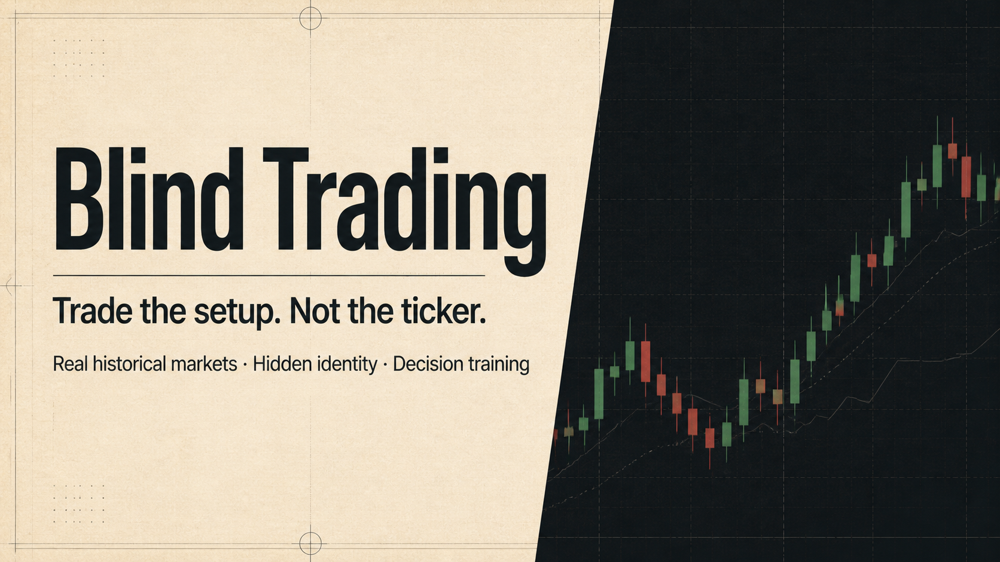

# 盲盘 · Mangpan



只看走势，不看答案。

「盲盘」是一款基于真实历史 K 线的交易训练游戏。股票身份、日期和后续走势会被隐藏，你需要在信息不完整的情况下判断方向、管理仓位，并在结算后复盘自己的决策。

[立即体验](https://mangpan-kline-game.hiayun.chatgpt.site) · [提交问题](https://github.com/ZYX121212/mangpan/issues)

## 为什么做盲盘

看见股票名称和历史答案后，判断总是容易得多。盲盘通过隐藏标的与日期，把注意力重新放回价格、成交量、风险和执行，让训练更接近真实决策。

## 核心玩法

- A 股与美股双市场，使用真实历史行情片段
- 每日同题挑战、无限练习和好友同图对决
- 趋势、拐点、急跌、高波动四类情境训练
- 12 课训练树，覆盖入门、标准和专家难度
- 模拟手续费、滑点、A 股整手与美股整数股交易
- 结算后揭晓股票与日期，逐笔复盘判断和后续走势
- 今日排行榜、每周联赛、XP、等级与成就系统
- 登录后同步训练档案，匿名玩家也可直接体验

## 本地运行

需要 Node.js `>=22.13.0`。

```bash
npm install
npm run dev
```

生产构建与测试：

```bash
npm run build
npm test
```

## 技术栈

- React 19 + TypeScript
- Vinext / Vite
- Cloudflare Workers + D1
- Drizzle ORM
- OpenAI Sites

## 项目结构

```text
app/       页面、游戏逻辑与 API
db/        D1 数据库定义
drizzle/   数据库迁移
public/    品牌与分享素材
tests/     渲染测试
worker/    Worker 入口
```

## 免责声明

本项目仅用于交易决策训练与娱乐，不提供投资建议，也不构成对任何证券的推荐。历史表现不代表未来结果。

## 参与贡献

欢迎提交 Issue 分享体验、数据问题或玩法建议。准备贡献代码时，请先创建 Issue 说明改动目标，再提交 Pull Request。
